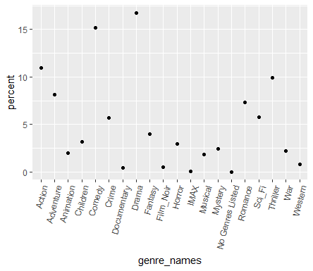
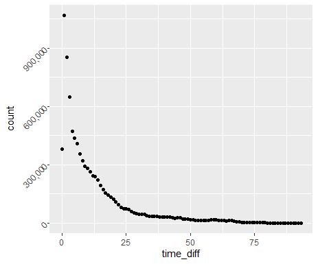
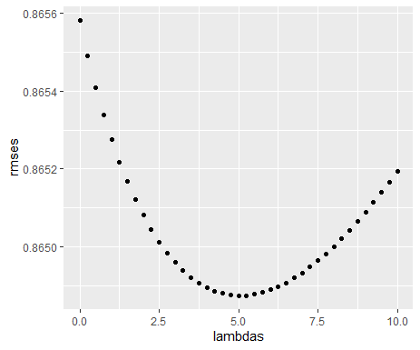
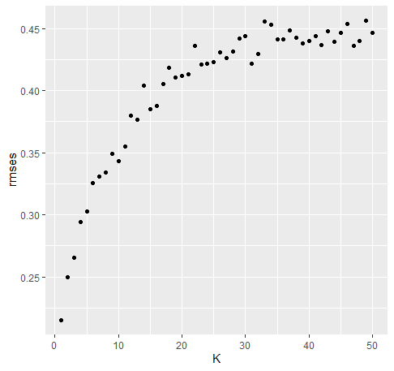

```{r setup, include=FALSE, message=FALSE, warning=FALSE}
library(tidyverse)
library(lme4)
knitr::opts_chunk$set(echo = FALSE, cache=FALSE)
knitr::knit_hooks$set(plot = function(x, options)  {
  paste0(knitr::hook_plot_tex(x, options), "\n\\FloatBarrier\n")
})
```

## Introduction

  Building algorithms for recommendation systems is a big part of data science these days. Improvements in prediction accuracy that would seem insignificant to the eye result in huge profit gains for companies that are doing business online. Due to moving online the business strategy changed as companies no longer need to optimize usage of shelf space as a result of which the amount of items on sale is nearly limitless. Companies doing business online create huge datasets of user preferences and use them to match customers with items they predict they are most likely to buy.
  
  The recommendation techniques used by a company differ depending on the kind of items that are being sold. Major approaches include content-based filtering and collaborative-based filtering. Sometimes it is some hybrid of methods. The project embarked on is meant to resemble the Netflix challenge of improving the root mean square error (RMSE) by 10%, which offered the winning team a prize of one million dollars in 2006. The winner team was BellKor's Pragmatic Chaos which managed to improve the Netflix algorithm by just a tad over 10%.  The reason Netflix decided on 10% is because around a 10% improvement was the most they could reasonably expect and an 11% improvement was already deemed unrealistic.      

  The goal of the project is to build a system that predicts a rating a user would give to a movie that he has not rated, based on the information that is provided to us in the dataset.

# Section 1: Data Overview

We are given a training dataset that provides over nine million observations (N = 9,000,055) for the rating given to movies by users. Each row is a unique combination of a movie ID and a user ID that provides the rating the user gave the movie. As a result movies that would be predicted to be given a high rating from a user will be recommended to that user. For every unique movie-user combination present in the dataset the dataset gives the title of the movie together with the year it was made, the rating the user gave the movie, the genre under which the movie could be classified and the timestamp, which is the time when the movie was rated. A movie often is classified under multiple genres at the same time.     

  The dataset used in the project is famous and is called the MovieLens dataset which is a small subset of a much bigger dataset used by Netflix for its challenge. The directions of the project were to split up the MovieLens dataset into three parts, being the training, testing and validation set. The first two mentioned were for creating and testing out algorithms while the third part was only for the final validation. The initial MovieLens dataset was first split into one 90% chunk called edx, which is the dataset for training and testing, and a 10% part called validation, which as the name suggests is for the final validation. It was after that that there was another splitting - the edx being broken up into a training and a testing set where I decided to use an 80%/20% split.  Thus, the validation set is reserved for the end and used only once as a final assessment.  The algorithms created on the training set would later be used on the testing set to see how well the model works. After the model is selected based from the results on the testing set it will be applied to the final data set, the validation set for a final assessment.

Here is a depiction of what the dataset looks like, showing the first six rows:

```{r, echo=FALSE, fig.cap="Preview of the dataset", out.width = '100%'}
setwd("C:\\data\\capstone")
knitr::include_graphics("edx_preview.png")
```

The dataset includes information about 10,677 unique movies and 69,878 unique users.

The ratings are measured on a five star scales from one half to five, in intervals of one half. The lowest value a user can give a movie is 0.5 and the highest in 5. All of the available ten ratings are as follows: 0.5, 1, 1.5, 2, 2.5, 3, 3.5, 4, 4.5, 5. The predicted rating is the outcome for the recommendation system.     

```{r, echo=FALSE, fig.cap="Histogram of ratings", out.width = '100%'}
setwd("C:\\data\\capstone")
knitr::include_graphics("ratings_histogram.png")
```

The figure above shows the distribution of ratings. Whole number ratings were given much more frequently than anything in between. Ratings of 3 and 4 were the most commonly occurring with this distribution coming from the training set. A rating of 3 appears 23.6% of the time and a rating of 4 appears 28.8% of the time. About one third of ratings were 3 or 3.5, about another third were 4 or 4.5, about 15% of the ratings were 5 - the highest score and rating below 3 were a little less than 20% of all of them.

The following figure shows the amount of movies premiered per year:

```{r, echo=FALSE, fig.cap="amount of movies premiered per year", out.width = '100%'}
setwd("C:\\data\\capstone")
knitr::include_graphics("movies_premiered_per_year.png")
```

The above graph shows a relatively steady increase in the amount of movies premiered starting from 1915 to about 1980 after which there is a sharp increase. From roughly 1983 to about 2002 there can be seen a general trend of a sharp rise and after that this rise is followed by a sharp decline. Perhaps the sharp decline has something to do with the recession around 2008. Another reason could be is that the database is truncated since it could take some time until new movies are added to Netflix.

```{r, echo=FALSE, fig.cap="Percentage of Views per Genre", out.width = '100%'}
setwd("C:\\data\\capstone")

```

The above graph shows the popularity in number of views for each of the genres in the dataset. The drama genre received the greatest amount of views at 16.7% followed by comedy not too far behind at 15.2%. Documentaries, Film_Noirs, IMAXs and Western were the least popular genres each having less the 1% of all the views.

In order to get the time difference between time of premiering and time of rating we need to do some data wrangling by extracting the year in which the movie was premiered and extracting the year of the timestamp, which is the second that the user rated a given movie. 

There was a tiny portion of movies that were rated prior to premiering which I decided to remove.

Graph of the distribution of time_diff, difference in years between when movie was rated and when it was premiered:


```{r, echo=FALSE, fig.cap="distribution of time between rating and premiering", out.width = '100%'}
setwd("C:\\data\\capstone")
 
```


```{r, echo=FALSE, fig.cap="distribution of time between rating and premiering", out.width = '100%'}
setwd("C:\\data\\capstone")
knitr::include_graphics("time_diff_distribution_table.png")
```

As can be seen from the output of the two previous figures, out of all the time intervals it was the year after the premiering year that more movies got rated than for any other time_diff. After that the amount of ratings given to a movie sharply declines overall as additional years pass. After roughly the first twenty-five years after premiering the average decrease in the amount of ratings a movie gets is tiny generally speaking.

# Section 2: Methods and Analysis

In this report we are using the nested linear models approach. We start with the simplest model that assigns the same rating to all movies plus the white noise random variation. We gradually generalize this linear model by adding user, movie and time effects, one at a time and then run a comprehensive model that incorporates them all. Later we also apply regularization to the comprehensive model.

The goal is to minimize the root mean square error (RMSE) which is defined as: 

$\sqrt{\frac{1}{N}\sum_{u,i}(\hat{y}_{u,i} - y_{u,i})^2}$ 

where $y_{u,i}$ is the rating given by user u to movie i and $\hat{y}_{u,i}$ is the predicted rating that user u would give movie i. N is the number of observations. The subscript of u will be used to denote the user effect which is the average deviation of the user rating, from the average rating of the training dataset $\mu$. The subscript of i will be used to denote the movie effect which is by how much on average the rating of a given movie differs from,$\mu$ plus the user effect. The subscript of t will be used to denote the difference in years between the time when the movie was rated and the time the movie was premiered (time difference). The time difference effect is similarly the average rating difference between the average rating of movies with a certain time difference, and $\mu$ plus the user effect plus the movie effect. 


The four linear models are as follows with the average of the training set denoted as $\mu$ and the three effects are as follows with $b_i$ being the movie effect, $b_u$ the user effect, $b_t$ the time difference effect and $\epsilon$ as the white noise term:

$Y_{u,i} = \mu + \epsilon$ (1)

$Y_{u,i} = \mu + b_{i} + \epsilon$ (2)

$Y_{u,i} = \mu + b_{i} + b_{u} +\epsilon$ (3)

$Y_{u,i} = \mu + b_{i} + b_{u} +b_{t} +\epsilon$ (4)

where $b_i$, $b_u$ and $b_t$ are defined as

$b_i = \frac{1}{N}\sum(y_i - \mu)$  
$b_u = \frac{1}{N}\sum(y_{i,u} - \mu - b_i)$  
$b_t = \frac{1}{N}\sum(y_{i,u} - \mu - b_i - b_u)$

Here the letter $b$ is used for the specific variable effects which reflect the biasfrom $\mu$

The histogram of the movie bias effect $b_i$ is shown below:

```{r, echo=FALSE, fig.cap="Histogram for the spread of movie effect", out.width = '100%'}
setwd("C:\\data\\capstone")
knitr::include_graphics("movie_effect_histogram.png")
```

The movie effect distribution is left-skewed showing that there were significantly more ratings that were significantly below $\mu$ than significantly above it.

We can see some variation in the size of movie effects. The majority of movie ratings are below the average.

Next is the user bias effect histogram. There are users that love nearly every movie they see and those that dislike nearly every movie they see.

```{r, echo=FALSE, fig.cap="Histogram for the spread of user effect", out.width = '100%'}
setwd("C:\\data\\capstone")
knitr::include_graphics("user_effect_histogram.png")
```


Compared with the movie effect histogram the user effect histogram is much more symmetrical spreading similarly in both directions. The left side seems to have a bit more outliers than the right and the left tail stretches out slightly farther than the right, with very few users giving a score that is on average more than two rating points below the mean.


```{r, echo=FALSE, fig.cap="Histogram for the spread of time\\_diff effect", out.width = '100%'}
setwd("C:\\data\\capstone")
knitr::include_graphics("time_diff_histogram_b_t.png")
```


The RMSE for model (1) was computed from merely taking the average of all the ratings in the training set and using that single value to predict the rating in the test set since if you could only use one value for all predictions it would be the average that would minimize the RMSE. This very simple model on the test set the RMSE was 1.061, the error greater than 1 which is not in the desired range of results, where the desired range being around 0.865 or even less. Thus, the movie effect was included into model (2) which reduced the RMSE by more than one tenth, giving an RMSE of 0.9436. Model (3) and model (4) further decrease the RMSE to 0.866 and 0.8656.  Below are the results of running the four models on the test set.

```{r, echo=FALSE, fig.cap="RMSEs for the Training Models", out.width = '100%'}
setwd("C:\\data\\capstone")
knitr::include_graphics("rmse_by_model_1_4_training.png")
```

After that I reran model (4) with regularization, which will be our model (5). The idea of regularization is to desensitize a model for outliers. Often times the effect of a variable may be strong due to a small number of ratings for a movie, which increases the chance that we might get something unrepresentative that would deviate significantly from what we would see had there been much more ratings for the movie. The penalty parameter $\lambda$ value for a new loss function is selected by calculating the RMSE for different values of $\lambda$. The $\lambda$ that gives the lowest RMSE is selected. For model (5) the loss function is:

$\frac{1}{N}\sum_{u,i}(y_{i,u,t} - \mu - b_{i} - b_{u} - b_{t})^2 + \lambda(\sum_{i}b_{i}^2 + \sum_{u}b_{u}^2 + \sum_{t}b_{t}^2)$ (5)

Here is the formula that minimizes the above sum (5):

${b}_{u}(\lambda) = \frac{1}{\lambda + n_{i}}\sum(Y_{u,i} - {\mu} - {b_i})$ (6)

${b}_{i}(\lambda) = \frac{1}{\lambda + n_{i}}\sum(Y_{u,i} - {\mu})$ (7)

${b}_{y}(\lambda) = \frac{1}{\lambda + n_{i}}\sum(Y_{u,i} - {\mu} - {b_i} - {b_u})$ (8)

It should be no surprise that the RMSE for $\lambda$ = 0 is the same as that of model (4), without regularization. After incorporating regularization the RMSE does improve a little. The $\lambda$ of 5 gives the lowest RMSE of 0.8649. Here is a graph that depicts the relation between lambda and RMSE.

```{r, echo=FALSE, fig.cap="RMSE by lambda graph", out.width = '100%'}
setwd("C:\\data\\capstone")

```

There are many other effects that can be incorporated. Initially I tried incorporating the year effect, which slightly reduced the RMSE but later I decided to use the difference in time between when the movie was rated and when it was premiered effect, $b_t$. This gave a slightly bigger RMSE reduction. 

After incorporating the difference in time between giving rating and premiering effect, $b_t$, the RMSE went down slightly more. The model now includes three predictors - user-effect, movie-effect and difference in time effect: $Y_{i,u,y} = \mu + b_i + b_u + b_t$ Here is the output of the RMSEs for the five models - first one using only mean rating in training set, next three incorporating the three effects and the fifth one adding regularization to the three incorporated effects:

```{r, echo=FALSE, fig.cap="RMSE by model", out.width = '100%'}
setwd("C:\\data\\capstone")
knitr::include_graphics("rmse_by_model_1_5.png")
```
  
The model (5) which includes all three factors: user effect, movie effect, and time difference effect as well as regularization gives us the lowest RMSE. Thus we will use model (5) to predict ratings for the validation dataset.
  
In the validation dataset there turn out to be thirty-six NA values for rating. Because of this the RMSE function is not ready to run on the ratings of the validation dataset. Because of this I replaced these 36 NA values with $\mu$ and the RMSE function ran fine after that.

# Section 3: Results

After applying model (5) to the validation dataset the resulting RMSE turns out to be 0.8652329. Some more complex models like the knn item to item possibly would have done better but due to limitations in computing power this was not feasible so I included some variables which you can normally expect to correlate with better RMSE scores. These were the user effect, movie effect and difference in time between premiering and when the rating was given. Each helped bring down the RMSE with effects of additional variables bringing a smaller decrease. Overall it is much better than just using the average.


The three models run on the validation set are model (1) (mainly for comparison purposes), model (4) and model (5) with a $\lambda$ value of 5. The final table that shows the RMSEs of these three models run on the validation set is shown below:

```{r, echo=FALSE, fig.cap="RMSE by model on the validation set", out.width = '100%'}
setwd("C:\\data\\capstone")
knitr::include_graphics("model_comparison_on_validation.png")
```

## Experimenting with KNN

```{r, echo=FALSE, fig.cap="RMSE by k", out.width = '100%'}
setwd("C:\\data\\capstone")

```

This KNN analysis was ran on a dataset much smaller than what we started out with since it is very computationally intensive. Also the task was changed a little from predicting the rating for every observation to predicting the average rating for each movie. The dataset was changed to have one record per movie where the average rating was provided for each. As can be seen from the graph the prediction gives the smallest RMSE for k = 1, giving an RMSE of 0.215. AT first the RMSE sharply increases as k gets bigger but around k = 30 the graph begins to plateau. The graph resembles a logarithmic function with a positive first derivative and a negative second.       

# Section 4: Conclusion

Overall here is the general summary of the report. The first step was to download the multi-million row movielens dataset and split it up into two parts - the edx dataset and the validation dataset with the edx dataset being 90% of the rows. The model would then be created using the edx dataset which was again split up into a training and testing dataset to see which model created using the training set performs best on the testing dataset, in order to use it on the final validation set.

Five previously mentioned models were used. The model (5) gave the smallest RMSE so that is the one I chose to use on the validation set.

After performing similar steps on the validation dataset as on the other parts including creating the difference in time between rating and premiering and replacing a few NAs with $\mu$ I run the final model. This is nearly a 0.2 improvement compared to just using $\mu$. The better your model gets the harder it becomes to make progress. For example it seems like improving the RMSE by one hundredth once it gets below 0.86 is a much harder task than improving it by say one tenth when it is around 1. Methods are constantly being developed and very likely the current level of accuracy will be improved as methodology and computing power increases.

## Limitations

In addition to linear models I attempted to use KNN. In order to do that I created a dummy variable for all of the genres so that whenever a movie would be classified under a certain genre there would be a 1 for that variable and 0 if the movie is not part of that genre. KNN is a very computationally intensive process that requires a lot of memory and the limitation was that the work was done on a laptop with moderate power. After attempting to run it the computer gave an error saying it can not allocate a vector of the required size.

## Future Work

The future of data science is growing as companies continuously strive to match customers to products they would want to buy. Improving the accuracy by as little as one thousandth can lead to massive profit gains for companies. Much of the methods are computationally demanding and may require powerful computing technology for which an ordinary pc may not be enough. The demand for prediction improvement as well as computing power are increasing thus it would be plausible to suppose that some major milestones in data science are still ahead.

# References

1.    Rafael A. Irizarry (2019), Introduction to Data Science: Data Analysis and Prediction Algorithms with R

2.    https://www.netflixprize.com/?

3.    https://www.edx.org/professional-certificate/harvardx-data-science?

4.    https://grouplens.org/?https://movielens.org/

5.    https://grouplens.org/datasets/movielens/latest/

6.    https://grouplens.org/datasets/movielens/10m/

7.    https://www.netflixprize.com/assets/GrandPrize2009_BPC_BellKor.pdf


